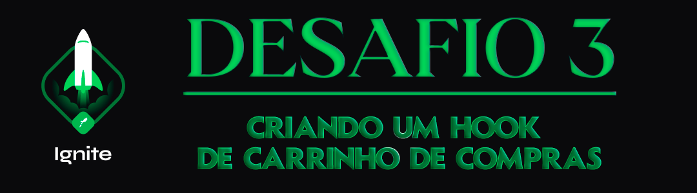

<div align="center">
  
</div>

<h1 align="center"> RocketSeat 🚀 Ignite ReactJS 🔥</h1>

<p align="center">
  <a href="https://rocketseat.com.br">
    
  </a>
  
  
  
</p>

## 🧠 Detalhes do desafio

Nesse desafio, você deverá criar uma aplicação para treinar o que aprendeu até agora no ReactJS

Essa será uma aplicação onde o seu principal objetivo é criar um hook de carrinho de compras. 
Você terá acesso a duas páginas, um componente e um hook para implementar as funcionalidades pedidas nesse desafio:

- [x] Adicionar um novo produto ao carrinho;
- [x] Remover um produto do carrinho;
- [x] Alterar a quantidade de um produto no carrinho;
- [x] Cálculo dos preços sub-total e total do carrinho;
- [x] Validação de estoque;
- [x] Exibição de mensagens de erro;

## ⚙️ Instalação do projeto

## Clone este repositório e acesse o diretório

```sh
$ git clone git@github.com:augustohermes/desafio-03-criando-hook-carrinho-de-compras.git && cd desafio-03-criando-hook-carrinho-de-compras
```

## Instale as dependências necessárias

```sh
$ yarn
```

## Rodando o projeto

```sh
$ yarn start
```

<br>

Feito com ❤️ por [Augusto Hermes](https://github.com/augustohermes) 👋.
